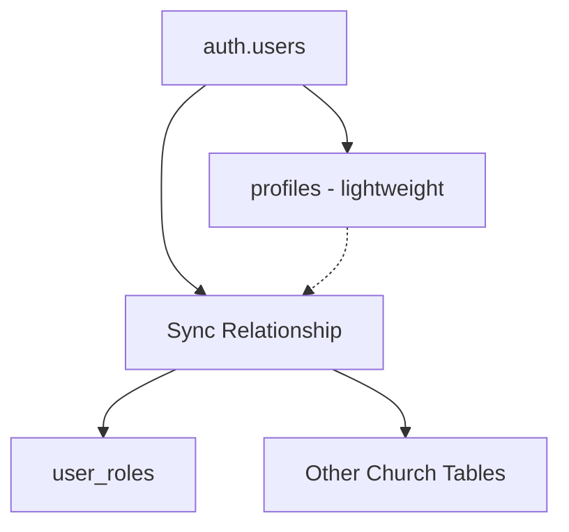

# Design Document

## Overview

The Gospel Labour Ministry database consolidation project aims to merge the `members` and `profiles` tables into a unified structure that eliminates data redundancy while preserving all existing functionality. Based on analysis of the current schema and application code, this design proposes a strategic consolidation approach that maintains backward compatibility and enhances data integrity.

## Current State Analysis

### Profiles Table Structure
```sql
CREATE TABLE profiles (
    id UUID REFERENCES auth.users(id) PRIMARY KEY,
    email VARCHAR(255) UNIQUE NOT NULL,
    full_name VARCHAR(255),
    phone VARCHAR(20),
    address TEXT,
    church_unit TEXT,
    assigned_pastor TEXT,
    genotype TEXT,
    role app_role DEFAULT 'user',
    created_at TIMESTAMP WITH TIME ZONE DEFAULT NOW(),
    updated_at TIMESTAMP WITH TIME ZONE DEFAULT NOW()
);
```

### Members Table Structure
```sql
CREATE TABLE members (
    id UUID DEFAULT gen_random_uuid() PRIMARY KEY,
    user_id UUID REFERENCES auth.users(id) ON DELETE SET NULL,
    email VARCHAR(255) NOT NULL UNIQUE,
    fullname VARCHAR(255) NOT NULL,
    phone VARCHAR(20),
    address TEXT,
    category member_category NOT NULL DEFAULT 'Members',
    title TEXT,
    assignedto UUID REFERENCES members(id),
    churchunit TEXT,
    churchunits TEXT[],
    auxanogroup TEXT,
    joindate DATE NOT NULL DEFAULT CURRENT_DATE,
    notes TEXT,
    isactive BOOLEAN NOT NULL DEFAULT true,
    created_at TIMESTAMP WITH TIME ZONE DEFAULT NOW(),
    updated_at TIMESTAMP WITH TIME ZONE DEFAULT NOW()
);
```

### Key Overlaps and Conflicts
1. **Email field**: Both tables have email columns with UNIQUE constraints
2. **Name fields**: `profiles.full_name` vs `members.fullname`
3. **Contact info**: Both have `phone` and `address` fields
4. **Church unit**: `profiles.church_unit` vs `members.churchunit` and `members.churchunits`
5. **User relationship**: `profiles.id` directly references `auth.users(id)` vs `members.user_id`

## Architecture

### Consolidation Strategy: Enhanced Members Table

After analyzing the application code and database usage patterns, the recommended approach is to **consolidate into an enhanced `members` table** while maintaining a lightweight `profiles` table for authentication purposes.

**Rationale:**
1. The `members` table contains richer church-specific data (category, pastor assignments, church units, etc.)
2. Application code primarily uses the `members` table for business logic
3. The `profiles` table is mainly used for authentication and basic user info
4. This approach minimizes application code changes

### Target Architecture



## Components and Interfaces

### Enhanced Members Table Schema

```sql
CREATE TABLE members (
    -- Primary identification
    id UUID DEFAULT gen_random_uuid() PRIMARY KEY,
    user_id UUID REFERENCES auth.users(id) ON DELETE SET NULL,
    
    -- Basic information (consolidated from both tables)
    email VARCHAR(255) NOT NULL UNIQUE,
    fullname VARCHAR(255) NOT NULL,
    phone VARCHAR(20),
    address TEXT,
    genotype TEXT, -- From profiles
    
    -- Church-specific information
    category member_category NOT NULL DEFAULT 'Members',
    title TEXT,
    assignedto UUID REFERENCES members(id),
    churchunit TEXT, -- Primary church unit
    churchunits TEXT[], -- Multiple church units
    auxanogroup TEXT,
    joindate DATE NOT NULL DEFAULT CURRENT_DATE,
    notes TEXT,
    isactive BOOLEAN NOT NULL DEFAULT true,
    
    -- Authentication and role information
    role app_role DEFAULT 'user', -- From profiles
    
    -- Metadata
    created_at TIMESTAMP WITH TIME ZONE DEFAULT NOW(),
    updated_at TIMESTAMP WITH TIME ZONE DEFAULT NOW(),
    
    -- Constraints
    CONSTRAINT valid_email CHECK (email ~* '^[A-Za-z0-9._%+-]+@[A-Za-z0-9.-]+\.[A-Za-z]{2,}$'),
    CONSTRAINT valid_phone CHECK (phone IS NULL OR phone ~* '^\+?[1-9]\d{1,14}$')
);
```

### Lightweight Profiles Table Schema

```sql
CREATE TABLE profiles (
    -- Direct auth.users reference
    id UUID REFERENCES auth.users(id) ON DELETE CASCADE PRIMARY KEY,
    
    -- Minimal authentication-related data
    email VARCHAR(255) UNIQUE NOT NULL,
    full_name VARCHAR(255),
    
    -- Metadata
    created_at TIMESTAMP WITH TIME ZONE DEFAULT NOW(),
    updated_at TIMESTAMP WITH TIME ZONE DEFAULT NOW()
);
```

### Synchronization Strategy

1. **Profiles → Members**: Automatic sync when users register
2. **Members → Profiles**: Update basic info when member data changes
3. **Bidirectional sync**: Maintain consistency between tables

## Data Models

### Member Entity (Enhanced)
```typescript
interface Member {
  // Identity
  id: string;
  user_id?: string;
  
  // Basic Information
  email: string;
  fullname: string;
  phone?: string;
  address?: string;
  genotype?: string;
  
  // Church Information
  category: 'Members' | 'Pastors' | 'Workers' | 'Visitors' | 'Partners';
  title?: string;
  assignedto?: string;
  churchunit?: string;
  churchunits?: string[];
  auxanogroup?: string;
  joindate: string;
  notes?: string;
  isactive: boolean;
  
  // Authentication
  role: 'user' | 'admin' | 'superuser';
  
  // Metadata
  created_at: string;
  updated_at: string;
}
```

### Profile Entity (Simplified)
```typescript
interface Profile {
  id: string; // auth.users.id
  email: string;
  full_name?: string;
  created_at: string;
  updated_at: string;
}
```

## Migration Strategy

### Phase 1: Data Consolidation
1. **Backup existing data**
2. **Create enhanced members table structure**
3. **Merge data from both tables**:
   - Prioritize non-null values
   - Handle conflicts with business rules
   - Preserve all unique data

### Phase 2: Function and Trigger Updates
1. **Update sync functions**
2. **Modify RLS policies**
3. **Update database triggers**
4. **Recreate indexes**

### Phase 3: Application Code Updates
1. **Update TypeScript interfaces**
2. **Modify database queries**
3. **Update React hooks**
4. **Test all functionality**

## Error Handling

### Data Conflict Resolution
1. **Email conflicts**: Use members table email as primary
2. **Name conflicts**: Prefer non-null, longer names
3. **Contact info conflicts**: Merge and validate
4. **Role conflicts**: Preserve highest privilege level

### Migration Rollback Strategy
1. **Backup tables**: `members_backup`, `profiles_backup`
2. **Transaction-based migration**: All-or-nothing approach
3. **Validation checkpoints**: Verify data integrity at each step
4. **Rollback procedures**: Restore from backups if needed

## Testing Strategy

### Data Integrity Tests
1. **Record count validation**: Ensure no data loss
2. **Unique constraint tests**: Verify email uniqueness
3. **Foreign key tests**: Validate all relationships
4. **Data type tests**: Ensure proper data conversion

### Functional Tests
1. **Authentication flow**: Login/logout/registration
2. **Member management**: CRUD operations
3. **Admin functions**: Role management, permissions
4. **Sync operations**: Profile-member synchronization

### Performance Tests
1. **Query performance**: Compare before/after metrics
2. **Index effectiveness**: Verify optimal query plans
3. **Concurrent access**: Test under load

## Security Considerations

### RLS Policy Updates
```sql
-- Enhanced member access policies
CREATE POLICY "Users can view own member record" ON members
    FOR SELECT USING (user_id = auth.uid());

CREATE POLICY "Admins can manage all members" ON members
    FOR ALL USING (
        EXISTS (
            SELECT 1 FROM user_roles 
            WHERE user_id = auth.uid() 
            AND role IN ('admin', 'superuser')
        )
    );
```

### Data Privacy
1. **Sensitive data protection**: Maintain existing privacy controls
2. **Audit trail**: Log all data migration operations
3. **Access control**: Preserve existing permission structure

## Implementation Phases

### Phase 1: Schema Enhancement (Week 1)
- Create enhanced members table structure
- Implement data consolidation logic
- Create backup and rollback procedures

### Phase 2: Data Migration (Week 1)
- Execute data consolidation
- Update database functions and triggers
- Validate data integrity

### Phase 3: Application Updates (Week 2)
- Update TypeScript interfaces
- Modify React hooks and components
- Update database queries

### Phase 4: Testing and Validation (Week 2)
- Execute comprehensive test suite
- Performance validation
- User acceptance testing

## Success Metrics

1. **Zero data loss**: All existing data preserved
2. **Performance maintained**: Query times within 10% of baseline
3. **Functionality preserved**: All features work as before
4. **Code simplification**: Reduced complexity in sync operations
5. **Data consistency**: Elimination of sync conflicts