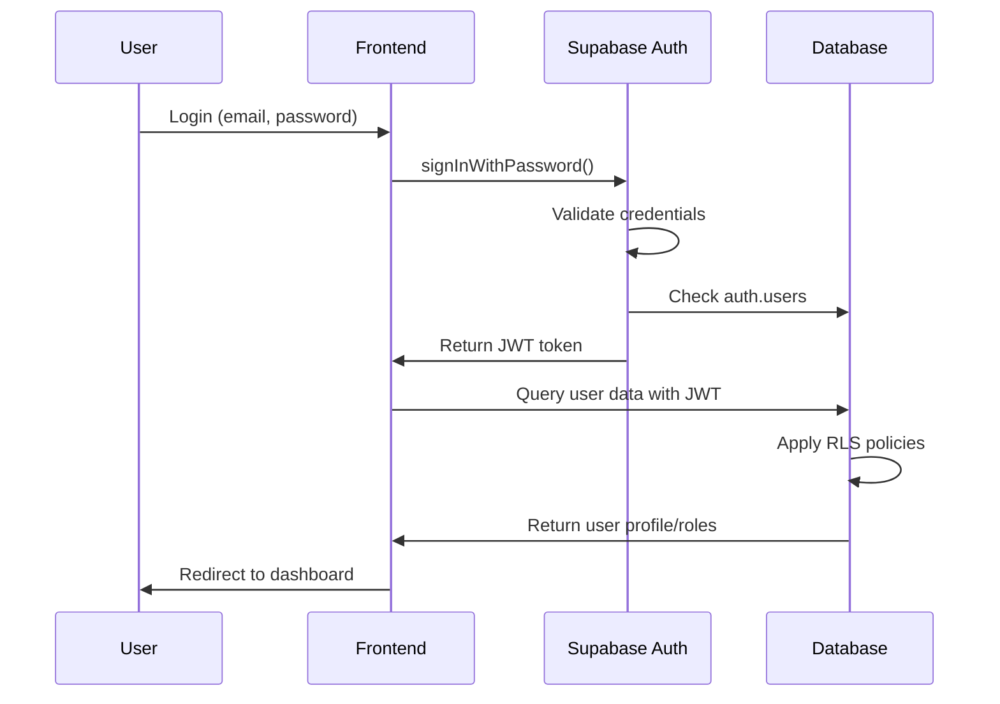

# Design Document

## Overview

This design addresses the critical superadmin authentication issue for ojidelawrence@gmail.com in the Gospel Labour Ministry church management system. The system uses Supabase as the backend with a React frontend, implementing a multi-table user management approach with authentication, profiles, members, and user roles.

The core issue is that while the superadmin account exists in the database with proper roles, authentication fails due to password-related problems and potentially restrictive Row Level Security (RLS) policies that create circular dependencies during the authentication process.

## Architecture

### Current System Architecture

```
Frontend (React/Vite)
├── Authentication Layer (Supabase Auth)
├── API Layer (Supabase Client)
└── Database Layer (PostgreSQL with RLS)

Database Schema:
├── auth.users (Supabase managed)
├── public.profiles (user extended info)
├── public.members (church member data)
└── public.user_roles (role assignments)
```

### Authentication Flow



### Problem Areas Identified

1. **Password Authentication**: Encrypted password in auth.users may be corrupted or incorrect
2. **RLS Policy Conflicts**: Circular dependencies where policies require auth.uid() but user can't authenticate to get uid
3. **Data Consistency**: Multiple tables (profiles, members) may have inconsistent data
4. **Email Confirmation**: Account may not be properly confirmed

## Components and Interfaces

### Authentication Service Interface

```typescript
interface AuthenticationService {
  // Core authentication methods
  signIn(email: string, password: string): Promise<AuthResult>
  resetPassword(email: string): Promise<void>
  confirmEmail(userId: string): Promise<void>
  
  // Admin methods (service role)
  updateUserPassword(userId: string, password: string): Promise<void>
  getUserByEmail(email: string): Promise<User | null>
  confirmUserEmail(userId: string): Promise<void>
}

interface AuthResult {
  user: User | null
  session: Session | null
  error: AuthError | null
}
```

### Database Service Interface

```typescript
interface DatabaseService {
  // User data management
  getUserProfile(userId: string): Promise<Profile | null>
  getMemberRecord(userId: string): Promise<Member | null>
  getUserRoles(userId: string): Promise<UserRole[]>
  
  // Admin operations
  createMissingRecords(userId: string, email: string): Promise<void>
  syncUserData(userId: string): Promise<void>
  verifyDataConsistency(userId: string): Promise<ConsistencyReport>
}
```

### RLS Policy Manager Interface

```typescript
interface RLSPolicyManager {
  // Policy management
  disableRLSTemporarily(tables: string[]): Promise<void>
  enableRLSWithSafePolicies(tables: string[]): Promise<void>
  createAuthenticationFriendlyPolicies(): Promise<void>
  
  // Emergency access
  grantEmergencyAccess(userId: string): Promise<void>
  revokeEmergencyAccess(userId: string): Promise<void>
}
```

## Data Models

### User Data Structure

```typescript
// auth.users (Supabase managed)
interface AuthUser {
  id: string
  email: string
  encrypted_password: string
  email_confirmed_at: Date | null
  last_sign_in_at: Date | null
  created_at: Date
  updated_at: Date
}

// public.profiles
interface Profile {
  id: string // FK to auth.users.id
  email: string
  full_name: string
  role: 'superuser' | 'admin' | 'user'
  created_at: Date
  updated_at: Date
}

// public.members
interface Member {
  id: string
  user_id: string // FK to auth.users.id
  email: string
  fullname: string
  category: 'Pastors' | 'Members' | 'MINT'
  churchunit: string
  isactive: boolean
  created_at: Date
  updated_at: Date
}

// public.user_roles
interface UserRole {
  id: string
  user_id: string // FK to auth.users.id
  role: 'superuser' | 'admin' | 'pastor' | 'member'
  created_at: Date
}
```

### Fix Operation Data Model

```typescript
interface SuperadminFixOperation {
  targetEmail: string
  targetPassword: string
  steps: FixStep[]
  verificationChecks: VerificationCheck[]
  rollbackPlan: RollbackStep[]
}

interface FixStep {
  id: string
  name: string
  description: string
  sqlQuery?: string
  jsFunction?: string
  expectedResult: string
  status: 'pending' | 'running' | 'completed' | 'failed'
  error?: string
}

interface VerificationCheck {
  name: string
  query: string
  expectedResult: any
  actualResult?: any
  passed?: boolean
}
```

## Error Handling

### Authentication Error Categories

```typescript
enum AuthErrorType {
  INVALID_CREDENTIALS = 'invalid_credentials',
  EMAIL_NOT_CONFIRMED = 'email_not_confirmed',
  ACCOUNT_LOCKED = 'account_locked',
  RLS_POLICY_BLOCK = 'rls_policy_block',
  DATABASE_CONNECTION = 'database_connection',
  UNKNOWN = 'unknown'
}

interface AuthErrorHandler {
  categorizeError(err